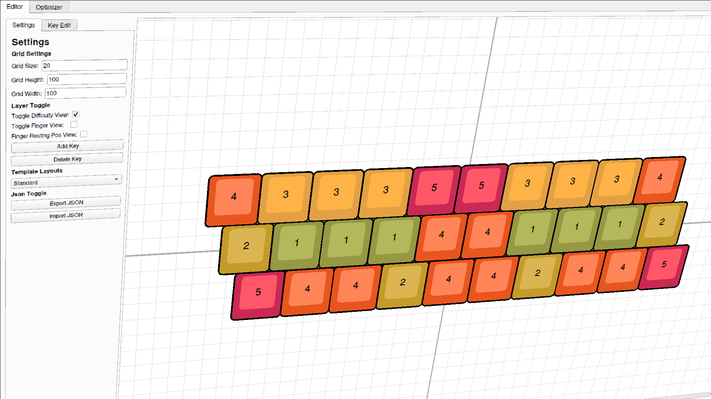

<h1 align="center">GECKO</h1>
<h3 align="center">Genitic Engine for Custom Keyboard Optimization</h1>

**GECKO** is a application designed to visualize and optimize custom keyboards. It can take any possible keyboard and though AI, generate an optimal keyboard layout for for that keyboard.

## Reading The Research

This project contains research that I will conduct as a part of GSST's senior research course.

Read the PDF <a href="https://joshuamarkle.github.io/research-project/research.pdf" target="_blank">here</a>.
