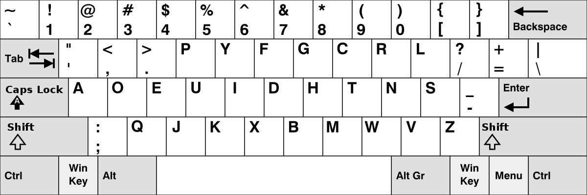
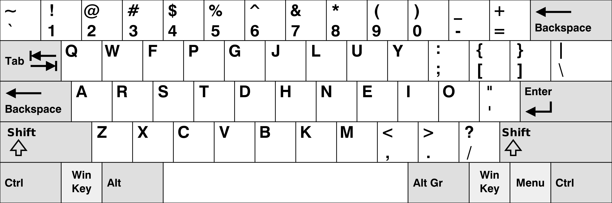

# Research Notebook - Joshua Markle

## Table of Contents

- 3 October 2023 - Research Significance
- Keyboard Layouts
  - 5 October 2023 - The Qwerty Layout
  - 6 October 2023 - The Dvorak Layout
  - 9 October 2023 - The Colemak Layout
- 14 October 2023 - Bash Scripting Keyboard Switch
- 15 October 2023 - Physical Keyboard Features
  - 22 October 2023 - Generic Physical Keyboards
  - 2 November 2023 - Split Keyboards
  - 3 November 2023 - Ortholinear Keyboards
  - 12 November 2023 - Curved Keyboards
- Layers
  - 17 November 2023 - General Keyboard Layers
  - 21 November 2023 - Symbol Layers
  - 30 November 2023 - Misc Keyboard Layers
- AI Enhanced Keyboard Layouts
  - 7 December 2023 - Genetic Algorithm Experimentation
  - 8 December 2023 - Genetic & Evolutionary Algorithms
  - 9 December 2023 - Setting Up Environment
  - 11 December 2023 - Parameterizing Training Data
  - 2 January 2024 - Quantifying A Keyboard
  - 4 January 2024 - Finding Datasets
  - 5 January 2024 - Building A Minimum Working Product
  - 9 January 2024 - Professionalizing The Project
  - 10 January 2024 - Adding Key Effort Into The Calculation
  - 17 January 2024 - Genetic Crossover Implementation
  - 31 January 2024 - Converting The Codebase to Python

## Time Sheet

| Date             | Title                                   | Time Taken |
| ---------------- | --------------------------------------- | ---------- |
| 3 October 2023   | Research Significance                   | 1h         |
| 5 October 2023   | The Qwerty Layout                       | 2h 30m     |
| 6 October 2023   | The Dvorak Layout                       | 1h         |
| 9 October 2023   | The Colemak Layout                      | 30m        |
| 14 October 2023  | Bash Scripting Keyboard Switch          | 3h         |
| 15 October 2023  | Physical Keyboard Features              | 1h 20m     |
| 22 October 2023  | Generic Physical Keyboards              | 1h 30m     |
| 2 November 2023  | Split Keyboards                         | 45m        |
| 3 November 2023  | Ortholinear Keyboards                   | 30m        |
| 12 November 2023 | Curved Keyboards                        | 30m        |
| 17 November 2023 | General Keyboard Layers                 | 1h         |
| 21 November 2023 | Symbol Layers                           | 2h         |
| 30 November 2023 | Misc Keyboard Layers                    | 30m        |
| 7 December 2023  | Genetic Algorithm Experimentation       | 30m        |
| 8 December 2023  | Genetic & Evolutionary Algorithms       | 2h         |
| 9 December 2023  | Setting Up Environment                  | 2h 30m     |
| 11 December 2023 | Parameterizing Training Data            | 1h 45m     |
| 2 January 2024   | Quantifying A Keyboard                  | 30m        |
| 4 January 2024   | Finding Datasets                        | 1h 30m     |
| 5 January 2024   | Building A Minimum Working Product      | 3h         |
| 9 January 2024   | Professionalizing The Project           | 6h 30m     |
| 10 January 2024  | Adding Key Efforts Into The Calculation | 1h         |
| 17 January 2024  | Genetic Crossover Implementation        | 1h         |
| 31 January 2024  | Coverting The Codebase to Python        | 4h 10m     |
| Total            |                                         | 40h        |

---

## Title: Research Significance

### Date: 3 October 2023

**Objective**: To explore the significance of keyboard layout research in modern computing and ergonomics.

Keyboard layouts, a fundamental aspect of our daily interaction with technology, plays an important role in determining typing efficiency, comfort, and overall user experience. Historically, the Qwerty layout has dominated keyboards since its creation in the late 19th century, primarily designed to prevent typewriter jams rather than to optimize typing speed or comfort. But it is important to know, how do different keyboard layouts impact typing efficiency, and is there room for improvement?

This research has direct implications on user productivity and ergonomic health. Typing is an almost universal activity in professional and personal settings, and even small improvements in efficiency or reductions in discomfort can have substantial effects. Understanding the mechanics and ergonomics of keyboard layouts can lead to innovations in keyboard design, potentially revolutionizing how we interact with computers.

Recent studies have shown that alternative layouts like Dvorak, Colemak, and Workman offer various benefits over Qwerty, such as reduced finger travel distance and more balanced usage of both hands. However, these benefits are often hidden by the widespread familiarity and standardization of the Qwerty layout.

The significance of researching keyboard layouts lies not only in enhancing typing efficiency and ergonomics but also in adapting to evolving technologies and user needs. Understanding the strengths and limitations of current layouts sets the foundation for developing more advanced and user-friendly input methods in the future. This research journey begins with dissecting the characteristics of a keyboard, which will be the focus of our next entry.

---

# Keyboard Layouts and Alternatives

This section is dedicated toward looking at example keyboard layouts to get a better grasp on the type of optimizations that can be made with these layouts.

---

## Title: The Qwerty Layout

### Date: 5 October 2023

**Objective**: To explore the historical background of the Qwerty layout and understand the pros and cons.

Most computers today have been standardized with the Qwerty layout. The layout was designed in the 1870s and was invented by Christopher Latham Sholes. It was specifically designed for typewriters but has know been adopted onto many modern mechanical keyboards. The arrangement of keys was made to prevent jams by seperating commonly used letter pairs, ensuring that the typewriter's mechanical arms wouldn't collide and stick together during fast typing.

As more people used Qwerty keyboards, the more necessary it became for others to learn and use the same layout to ensure compatibility in a professional environment. This effect is further amplified by the global nature of technology and communication, wherein a universally recognized standard becomes more convenient and practical.


Critics of Qwerty often point out its inefficiencies, such as increased finger travel and potential for strain, arguing that alternative layouts could offer ergonomic benefits and increased typing speed. However, despite these arguments, the switch to alternative layouts has been slow, primarily due to the ingrained nature of QWERTY in our society and the significant investment required to shift to a new system.

| Advantages of QWERTY                                                                                                                     | Disadvantages of QWERTY                                                                                                                                      |
| ---------------------------------------------------------------------------------------------------------------------------------------- | ------------------------------------------------------------------------------------------------------------------------------------------------------------ |
| **Widespread Familiarity**: Universally recognized and used, making it a standard in education and professional settings.                | **Inefficient Key Placement**: Frequent letters and letter combinations are not optimally placed, leading to increased finger movement and potential strain. |
| **Ease of Adoption**: Due to its prevalence, most people are already accustomed to it, reducing the learning curve for new users.        | **Historical Design Limitations**: Originally designed to prevent typewriter jams rather than for typing efficiency or ergonomics.                           |
| **Universal Compatibility**: Standard in most software and hardware, ensuring seamless interaction across various devices and platforms. | **Potential for Repetitive Strain**: The layout can contribute to discomfort and repetitive strain injuries, especially in heavy users.                      |
| **High Availability**: All keyboard manufacturers produce QWERTY keyboards, making them easily accessible.                               | **Suboptimal for Non-English Languages**: Not ideally suited for languages with different character frequencies compared to English.                         |
| **Network Effect**: The more people use it, the more valuable it becomes as a shared method of typing, reinforcing its dominance.        | **Resistance to Change**: The entrenched nature of QWERTY makes transitioning to more efficient layouts challenging on a large scale.                        |

---

## Title: The Dvorak Layout

### Date: 6 October 2023

**Objective**: To evaluate the Dvorak keyboard layout by outlining its pros and cons.

The Dvorak layout, created by Dr. August Dvorak in the 1930s, was designed with the goal of increasing efficiency and reducing finger fatigue. While it offers several ergonomic and potential speed benefits, its adoption faces hurdles such as the learning curve and limited recognition.



| Advantages of Dvorak Layout                                                                                                                 | Disadvantages of Dvorak Layout                                                                                                                 |
| ------------------------------------------------------------------------------------------------------------------------------------------- | ---------------------------------------------------------------------------------------------------------------------------------------------- |
| **Reduced Finger Movement**: Designed to minimize the distance fingers need to travel, potentially increasing typing speed.                 | **Steep Learning Curve**: Transitioning from QWERTY to Dvorak can be challenging and time-consuming, especially for proficient QWERTY typists. |
| **Ergonomic Efficiency**: Places the most commonly used letters in the home row, reducing finger fatigue and strain.                        | **Limited Availability**: Not as readily available as QWERTY keyboards, which can be a hurdle in widespread adoption.                          |
| **Balanced Hand Usage**: More evenly distributes typing between both hands, reducing the load on the dominant hand.                         | **Compatibility Issues**: Some software and shortcuts are optimized for QWERTY, leading to potential inconvenience when using Dvorak.          |
| **Potential for Speed Increase**: Users may experience an increase in typing speed after mastering the layout, due to its efficient design. | **Initial Productivity Drop**: Learning Dvorak often results in a temporary decrease in typing speed and productivity.                         |
| **Reduced Risk of Repetitive Strain Injury**: Ergonomic design may lower the risk of conditions like carpal tunnel syndrome.                | **Lack of Recognition**: Not as universally recognized, which might be problematic in educational and professional environments.               |

---

## Title: The Colemak Layout

### Date: 9 October 2023

**Objective**: To analyze the Colemak keyboard layout by delineating its advantages and disadvantages in a comprehensive format.

The Colemak layout, emerging as a modern alternative to QWERTY, is engineered to enhance typing efficiency and ergonomics while retaining some familiarity with the QWERTY arrangement. Its design aims to address the inefficiencies of QWERTY while easing the transition process.



| Advantages of Colemak Layout                                                                                                                                | Disadvantages of Colemak Layout                                                                                                 |
| ----------------------------------------------------------------------------------------------------------------------------------------------------------- | ------------------------------------------------------------------------------------------------------------------------------- |
| **Reduced Finger Travel**: Designed to minimize finger movement, enhancing typing efficiency and comfort.                                                   | **Learning Curve**: Switching from QWERTY to Colemak requires retraining, which can be challenging for many users.              |
| **Ergonomic Design**: Places the most frequently used letters on the home row, reducing strain and the risk of repetitive stress injuries.                  | **Limited Hardware Support**: Not as widely supported as QWERTY in terms of physical keyboard availability.                     |
| **Easy Transition from QWERTY**: Shares several key placements with QWERTY, making the learning process somewhat easier than for other alternative layouts. | **Adaptation Time for Typing Speed**: Initial slowdown in typing speed as users adapt to the new layout.                        |
| **Maintains Common Shortcuts**: Preserves the positioning of common keyboard shortcuts (like Ctrl+C/V), easing the transition for users.                    | **Software Compatibility Issues**: Some software and operating systems may require additional configuration to support Colemak. |
| **Potential for Increased Typing Speed**: Users may experience a boost in typing speed once they become proficient with the layout.                         | **Less Recognition**: Not as well-known or accepted in professional and educational settings compared to QWERTY.                |

---

## Title: Bash Scripting Keyboard Switch

### Date: 14 October 2023

**Objective**: Create a small bash script that I can use to switch between keyboard layouts quickly.

The core idea is to check what the current layout of the computer is and then switch it based from there. The `setxkbmap` command switches the current keyboard layout for Arch linux and the `grep` and `awk` commands are used to quickly search for certain keywords (in this case, a keyboard layout).

In the end, this was the final bash script that is used in my Arch Linux environment:

```bash
#!/bin/bash

# Check the current keyboard variant
layout=$(setxkbmap -query | grep variant | awk '{print $2}')

# Switch to the other layout
if [ "$layout" != "dvorak" ]; then
    setxkbmap -layout us -variant dvorak
    notify-send -u normal "Keyboard" "Switched layout to dvorak"
else
    setxkbmap us
    notify-send -u normal "Keyboard" "Switched layout to qwerty"
fi
```

---

# Physical Keyboard Features

This section will focus on the physical aspects of a keyboard and what are the pros and cons of these features.

---

## Title: Generic Physical Keyboards

### Date: 14 October 2023

**Objective**: To understand and analyze the features and functionalities of various popular generic keyboard layouts, focusing on their key distributions and specific design characteristics.

1. **Full-Size Keyboard (100%)**:

   - Features a dedicated numeric keypad, ideal for data entry and number crunching.
   - Offers more space, reducing the likelihood of hitting wrong keys during touch typing.
   - Usually comes with a wrist rest, aiding in comfort during extended typing sessions.

2. **TenKeyLess Keyboard (TKL – 80%)**:

   - Omits the numeric keypad, making it more compact and portable.
   - Popular among gamers and users who rely on shortcuts, as it allows more space for mouse movement.
   - Typically contains 104 to 108 keys, depending on the layout.

3. **1800 Layout Keyboard**:

   - A variation of the QWERTY layout, it incorporates a numeric pad but clusters keys closer than a full-size keyboard.
   - Integrates arrow and navigation keys into the numeric pad area, offering a compact yet function-rich layout.

4. **75% Keyboard**:

   - Compact and includes most essential keys, making it suitable for everyday use, gaming, and navigation.
   - Often programmable, allowing for macro customization and shortcut creation.
   - Slightly more compact than tenkeyless keyboards, saving desk space.

5. **65% Compact Keyboard**:

   - Falls between full-size and 40% keyboards, typically featuring about 70 keys.
   - Excludes numeric pad and function keys, focusing on the main alphanumeric characters.
   - Compact size enhances portability and desk space utilization.

6. **60% Keyboard**:

   - Even more compact than 65% keyboards, removing keys such as arrows for further size reduction.
   - Popular among gamers and keyboard enthusiasts for its portability and ergonomic design.
   - Allows high customization, including third-party keycaps and switches.

7. **40% Keyboards**:

   - The smallest functional keyboard size, omitting number rows, arrow keys, and non-letter keys.
   - Ideal for minimalistic setups and portable use, but requires adjustment to frequently changing layers for numbers and symbols.
   - Rare and often requires custom assembly or participation in group buys.

Each of these keyboards have their pros and cons but ultimately, the keyboards that have more keys only make it harder to press all of those keys. A smaller keyboard will have keys that are always within a comfortable reach.

---

## Title: Split Keyboards

### Date: 2 November 2023

**Objective**: To explore the concept of split keyboards and understand their unique features and advantages in ergonomic design.

Split keyboards are designed to cater to the natural positioning of hands and wrists, offering a more comfortable typing experience. Unlike traditional keyboards, they are divided into two distinct sections, which can be positioned independently. This design allows for a more natural hand, wrist, and shoulder position, reducing strain and discomfort during prolonged typing sessions.

| Advantages of Split Keyboards                                                                                  | Disadvantages of Split Keyboards                                                          |
| -------------------------------------------------------------------------------------------------------------- | ----------------------------------------------------------------------------------------- |
| **Ergonomic Design**: Reduces strain on wrists and hands, aligning with natural hand positioning.              | **Adjustment Period**: Takes time to get accustomed to the split layout and typing style. |
| **Customizable Positioning**: Allows for individual adjustment of each section for optimal comfort.            | **Space Requirement**: Might require more desk space due to the separate sections.        |
| **Reduced Risk of RSI**: Potentially lowers the risk of repetitive strain injuries due to improved ergonomics. | **Cost**: Often more expensive than traditional keyboards.                                |
| **Increased Typing Efficiency**: Can lead to faster and more comfortable typing once mastered.                 | **Portability**: Less portable compared to one-piece keyboards.                           |

In summary, split keyboards represent a significant advancement in ergonomic typing. While they require an initial adjustment period and might be more costly, the long-term benefits for comfort and health make them a valuable choice for anyone spending extensive time typing.

---

## Title: Ortholinear Keyboards

### Date: 3 November 2023

**Objective**: To understand the design and utility of ortholinear keyboards and their impact on typing.

Ortholinear keyboards are characterized by their keys being aligned in straight rows and columns, as opposed to the staggered layout of traditional keyboards. This alignment is said to mirror the natural motion of fingers more closely, potentially reducing finger travel and increasing typing efficiency. The straightforward grid layout also aims to simplify the learning curve for touch typing and may lead to fewer typing errors.

| Advantages of Ortholinear Keyboards                                                       | Disadvantages of Ortholinear Keyboards                                                   |
| ----------------------------------------------------------------------------------------- | ---------------------------------------------------------------------------------------- |
| **Natural Finger Movement**: Aligns with the straight motion of fingers, reducing strain. | **Learning Curve**: Requires adjustment from traditional staggered layouts.              |
| **Potentially Increased Accuracy**: Straight rows may lead to fewer typing mistakes.      | **Limited Availability**: Fewer options in the market compared to traditional keyboards. |
| **Compact Design**: Often more compact, saving desk space.                                | **Customization Requirement**: May need customization for optimal use.                   |
| **Aesthetic Appeal**: Unique and minimalistic design.                                     | **Not Standardized**: Lacks the universal familiarity of traditional layouts.            |

Ortholinear keyboards, with their distinct design and potential ergonomic benefits, present an interesting alternative to conventional keyboard layouts. While they may require a period of adjustment and are not as widely available, their potential for a more efficient and accurate typing experience makes them an intriguing choice for keyboard enthusiasts and professionals alike.

---

## Title: Curved Keyboards

### Date: 12 November 2023

**Objective**: To examine the design and benefits of curved keyboards, which are tailored to the varying lengths of fingers and natural hand posture.

Curved keyboards are designed with ergonomics at their core, featuring keys that are staggered both forward and backward to match the different lengths of a user's fingers. This design aims to provide a more natural hand positioning, reducing the strain on fingers, wrists, and arms. By aligning the keys with the natural reach of each finger, curved keyboards strive to create a more comfortable and efficient typing experience.

| Advantages of Curved Keyboards                                                                             | Disadvantages of Curved Keyboards                                                               |
| ---------------------------------------------------------------------------------------------------------- | ----------------------------------------------------------------------------------------------- |
| **Ergonomic Finger Alignment**: Matches the natural finger length and movement, reducing strain.           | **Adaptation Period**: May require time to get used to the unique key placement.                |
| **Reduced Typing Effort**: Eases the pressure on fingers, potentially increasing typing speed and comfort. | **Availability**: Less commonly found and often more expensive than standard keyboards.         |
| **Potential for Increased Accuracy**: More intuitive key placement can lead to fewer typing errors.        | **Size and Portability**: Generally bulkier, making them less portable than flat keyboards.     |
| **Aesthetically Pleasing**: Often have a unique and modern design.                                         | **Compatibility**: May not be compatible with all types of computer setups or user preferences. |

In conclusion, curved keyboards offer a novel approach to ergonomic typing, focusing on reducing physical strain and enhancing typing efficiency. While they present certain challenges in terms of adaptation and availability, their potential benefits in comfort and health make them a compelling option for users looking to optimize their typing experience.

---

## Title: General Keyboard Layers

### Date: 17 November 2023

**Objective**: To elucidate the concept of layers in keyboard design, focusing on the general or basic layer and its functionalities.

In keyboard technology, a "layer" refers to a level of key functionality that exists on top of the physical keys. Each layer offers a different set of functions or characters, accessible without physically changing the keys. The general layer is the most basic and commonly used layer, which includes the standard keyboard layout - the alphanumeric keys, space bar, enter key, and so on.

This primary layer is often accompanied by modifier keys like 'Shift' and 'Control', which temporarily switch the keyboard to different layers when held down. For instance, holding 'Shift' accesses uppercase letters and other secondary characters on keys, while 'Control' can be used in combination with other keys for shortcuts and special commands.

The whole essense of layers is to enhance the functionality of a keyboard without increasing its physical size, allowing for a compact yet versatile input device. Layers become really important as the size of the keyboard goes down. In this experiment, the keyboard to be optimized is only 30 keys, just enough for the alphabet. This mirrors the corne keyboard, a split, ortholinear, keyboard where every key is only one finger movement away.

One of the goals is to optimize every layer on the keyboard, mainly the general layers.

---

## Title: Symbol Layers

### Date: 21 November 2023

**Objective**: To explore the design and implementation of a symbol layer on keyboards.

A symbol layer on a keyboard is a dedicated layer that transforms the primary keys into symbols. This feature is especially valuable for software developers and those using smaller keyboards, as it allows for easy access to frequently used non-alphabetic characters like brackets, mathematical symbols, and punctuation. Typically, this layer is accessed by holding down a modifier key, such as AltGr (Right Alt), enabling the user to type symbols from more accessible keys, like the home row.

Designing an effective symbol layer involves considering the frequency and ease of access to various symbols. For instance, on standard keyboards, many symbols are located in the top-right corner, making them hard to type efficiently. By reassigning these symbols to keys within closer reach, typing speed and comfort can be significantly improved. The design can be customized to include digits, accented characters, or other specialist symbols, depending on the user's specific needs.

In the context of smaller keyboards, where space is limited, a symbol layer becomes even more crucial. It follows the '1u principle,' ensuring that commonly typed keys are no more than one key-unit distance from the home position. This approach is not only necessary for 40% boards but also beneficial for larger keyboards.

When designing a symbol layer, it's essential to prioritize the layout for more frequent symbols based on the user's specific programming languages or typing requirements. For example, a layout optimized for C++ and Python might group keys related to comparisons, arithmetic, and bitwise operators. Similarly, considerations for easy inward and outward rolls can enhance typing efficiency for common bigrams and symbol combinations.

There are various existing designs and resources available for reference, such as Seniply, Miryoku, and others, which provide insights into effective symbol layer layouts. These examples can serve as inspiration or a starting point for customizing your own symbol layer, tailored to your specific typing habits and requirements.

---

## Title: Misc Keyboard Layers

### Date: 30 November 2023

**Objective**: To understand the purpose and functionality of miscellaneous keyboard layers, such as function layers, and their role in enhancing keyboard utility.

Miscellaneous keyboard layers, including a function layer or a layer with additional controls, are designed to extend the functionality of a keyboard beyond its standard capabilities. These layers typically include keys for media control (play, pause, volume), Bluetooth connectivity, arrow keys for navigation, and other specialized functions. These layers are particularly beneficial in compact keyboards, where space is at a premium, but are also useful in standard keyboards for streamlining workflows and enhancing convenience.

The function layer, for instance, might include keys for F1 to F12 functions, often used in software applications and operating systems for quick access to specific features. Media control keys allow users to manage their audio and video playback without leaving the keyboard, offering a seamless multitasking experience. Similarly, Bluetooth control keys can enable quick switching between connected devices, enhancing the keyboard's versatility in multi-device setups.

---

# AI Enhanced Keyboard Layouts

---

## Title: Genetic Algorithm Experimentation

### Date: 7 December 2023

**Objective**: To explore the current state of AI-enhanced keyboard layouts and outline an experimental approach for creating an optimal keyboard layout using a genetic algorithm.

Recent advancements in keyboard layout design have been significantly influenced by AI technologies. One notable example is the Halmak keyboard layout, an AI-designed layout constructed within the keyboard-genetics project. This layout was developed based on real-world hand movements analysis, aiming for maximal typing efficiency and minimal finger movement distances. The Halmak layout, in efficiency comparisons, has shown significant improvements over traditional layouts like QWERTY, Dvorak, and Colemak (GitHub - kaievns/halmak)[https://github.com/kaievns/halmak].

In designing an experiment to create an optimal keyboard layout using a genetic algorithm, several steps are crucial. The process begins with the selection of a set of commonly used words. For example, the Longman Communication 3000 list, which includes the most frequent words in English, can serve as a basis. The frequency of each letter and their pair combinations are then analyzed using tools like Text Analyzer. This analysis forms the foundation for the genetic algorithm, which aims to minimize finger travel on the virtual keyboard by optimizing key placements based on frequency and ergonomic considerations (PLOS ONE - Application of a genetic algorithm to the keyboard layout problem).

The genetic algorithm iteratively adjusts the layout, evaluating each iteration based on specific parameters like finger movement distance, common bigrams or trigrams, and ergonomic factors. The objective is to find a layout that minimizes finger movement and maximizes typing efficiency.

For my research, the focus will be on designing both a general layer and symbol layer that is particularly useful for typing normal english but also typing code. This involves considering the frequency of symbol usage in programming languages and placing these symbols in easily accessible positions on the keyboard.

---

## Genetic & Evolutionary Algorithms

### Date: 8 December 2023

**Objective**: Research and gain a better understanding of modern literature on genetic algorithms for the purpose of optimizing a keyboard layout using machine learning.

Machine learning is a good way to get an optimized result using statistics and math. Genetic and evolutionary algorithms are a subset of this that simulation an environment with natural selection where only the best get to reproduce. In the case of this research, only the best keyboard that is tested to be the best gets to reproduce and mutate into a better keyboard.

Implementing this involves two approaches:

1. Mutations: Mutating a keyboard is easy. Take the best keyboard and then make random switches between the keys a certain number of times and then test the new keyboard to see if it is better. This is simple but it doesn't work really well. It relies heavily on luck to get to the best keyboard and follows more of a logarithmic progression on advancement.
2. Crossover: This approach is about taking the best keyboard layouts and then merging them to make a (hopefully) better keyboard. This is probably the best approach but it not easy to implement. There will have to be more research on this topic in the future before an actual implementation can take place.

---

## Setting Up Environment

### Date: 9 December 2023

**Objective**: Map out and start work on creating an evironment for development on the code that generates the optimized keyboard layouts based on a genetic algorithm.

For this project, C++ is going to be the prefered language because of how fast it is. This language is known as the benchmark to test how slow other languages are so in this case, it will handle the large amonut of data processing that will take place. The specefic programming environment is Neovim, a highly customizable text editor that is lightweight but powerful.

The folder structure will resemble something like this:

```
.
├── README.md
├── research.md
├── research.pdf
└── src
   ├── Makefile
   ├── main.cpp
   ├── analysis.cpp
   ├── utils.cpp
   └── data
      ├── quotes.json
      ├── cpp.json
      └── python.json
```

**Features**:

- Here, there is a folder that will contain all of the source code `src`.
- In here, there is a `Makefile` that will be able to actually build the application. Essentially, a `Makefile` is a file that runs a bunch of `bash` programming to build the executable file that will run the genetic algorithm.
- The `main.cpp`, `analysis.cpp`, and `utils.cpp` files are all source code files with their own uses.
- The `data` directory holds the training data that is used to actually train these keyboard layouts. Each different set of data will result is different keyboard layouts. For example, a layout optimized for normal English will be different than a layout optimized for C++ programming.

---

## Parameterizing Training Data

### Date: 11 December 2023

**Objective**: Formulate a way to quantify how good a keyboard layout is.

**Features To Track**:

1. The most important factor to a good keyboard is the finger distance traveled. A keyboard that makes you move your fingers all around the keyboard when typing is objectively worse than one that allows you to type mostly on the home row.
2. The amonut of effort it takes to hit the key. The index fingers and middle fingers are both much stronger than the pinky fingers. Therefore, more important letters sholud tend to hover around stronger fingers. There are also middle keys that are really incovienint and two middle keys that are a pain to reach.
3. Bigrams and trigrams are also important. Not so much as the speed of typing but the overall typing experience. It feels much better to type inwards from the pink to the ring to the middle to the index finger and akward when typing outwardly. Common bigrams such as "th" and "ch" and trigrams such as "the" and "cha" should typically follow this pattern of inward typing.

Taking these aspects into account, an array can be constructed that represents the importance and effort for each key on the keyboard.

**C++ Implementation**:

```cpp
const int KEY_COUNT = 30;
const int keyDistances[KEY_COUNT] = {
	11, 11, 11, 11, 13, 17, 11, 11, 11, 11, // Upper row
    0,  0,  0,  0,  10, 10,  0,  0,  0,  0, // Home row
    12, 12, 12, 12, 19, 12, 12, 12, 12, 12  // Lower row
};
const int keyEfforts[KEY_COUNT] = {
	6,  2,  1,  6, 11, 14,  9,  1,  1,  7, // Upper row
    1,  0,  0,  0,  7,  7,  0,  0,  0,  1, // Home row
    7,  8, 10,  6, 10,  4,  2,  5,  5,  3  // Lower row
};
```

In this senario, the keyboard has a total of 30 keys, 10 keys for each row. These are good approximate values for the distances the finger needs to travel and the effort that it would take to type that key.

**Example Layout**:

```cpp
std::vector<char> qwertyLayout = {
	'q', 'w', 'e', 'r', 't', 'y', 'u', 'i', 'o', 'p',
	'a', 's', 'd', 'f', 'g', 'h', 'j', 'k', 'l', ';',
	'z', 'x', 'c', 'v', 'b', 'n', 'm', ',', '.', '?'
};
```

---

## Quantifying A Keyboard

### Date: 2 January 2023

**Objective**: Construct an equation that will be used to test how good a keyboard is by using the parameterization techniques.

In order to start the machine learning process, there needs to be a good way to test how good a keyboard is. The simplest way to do this is to take a letter from the dataset and find the finger distance needed to press it and then go to the next letter and on and on. This way, after going through all of the training data, all of the letters have been testing and the total distance traveled is tracked.

---

## Finding Datasets

### Date: 4 January 2023

**Objective**: Find a good dataset that can be used to train the machine learning algorithm.

The dataset for this project is going to be a dataset from huggingface, a online platform that has resources for training AI models. Credit goes to Abirate for making the dataset and sharing it publicly with free use. The dataset is composed of thousands of english quotes that is perfect for this machine learning project.

[Abirate/english_quotes](https://huggingface.co/datasets/Abirate/english_quotes)

In the C++ code, a simple integration of finding an english quote would look something like this:

```cpp
// Find a random quote in the JSONL file
string getRandomQuote() {
	string filename = "data/quotes.jsonl";
    ifstream file(filename);
    if (!file.is_open()) {
        cerr << "Error: Unable to open file '" << filename << "'" << endl;
        return "";
    }

    vector<string> quotes;
    string line;
    while (getline(file, line)) {
        quotes.push_back(line);
    }

    // Seed the random number generator
    srand(static_cast<unsigned>(time(nullptr)));

    // Pick a random quote
    int randomIndex = rand() % quotes.size();
    string randomQuote = quotes[randomIndex];

	// Extract the "quote" part from the JSON object
    size_t quoteStart = randomQuote.find("\"quote\":\"");
    if (quoteStart != string::npos) {
        quoteStart += 9; // Move to the start of the actual quote
        size_t quoteEnd = randomQuote.find("\"", quoteStart);
        if (quoteEnd != string::npos) {
            string quoteText = randomQuote.substr(quoteStart, quoteEnd - quoteStart);
			return quoteText;
        }
    }

    return "";
}
```

Here, we grab a random quote from our dataset, clean it up with regex and then return it. This function can be used to create a large and random body of text that semi-accurately represents the english language. In the future, this function could be improved if it took in any text file. This would make it easier to train based on small little dataset and find the perfect keyboard for that task. For example, a text file with someone's english paper could train the AI to make the best keyboard layout for typing that particiular essay.

---

## Building A Minimum Working Product

### Date: 5 January 2023

**Objective**: Create a minimum working product for the algorithm and make it slowly optimize generations of keyboard layouts.

For this minimum working product, the features will be limited for the goal of making sure that they work in practice.

**Features**:

- Generations: each generation of keyboards are made up of the best keyboard layout in the past but mutated randomly.
- Mutations: Keyboard layouts in each generations have mutations in the hope that they randomly become a better keyboard layout.
- Data: A random set of english quotes are stringed together to make the training data for that keyboard.
- Logging: A short summary of the results are output every couple of generations to track the optimization progression.

**Constants**:

Some helpful constants for the generational runs. These can be optimized too but through trail and error.

```cpp
const int KEY_COUNT = 30;
const int NUM_KEYBOARDS = 12;
const int MAX_MUTATIONS = 100;
const int NUM_GENERATIONS = 1000;
const int NUM_GEN_QUOTES = 100;
```

**Genetic Algorithm Code**:

```cpp
// Genetic algorithm function
void optimizeKeyboardLayout() {
    srand(static_cast<unsigned>(time(nullptr)));

    vector<vector<char>> keyboards(NUM_KEYBOARDS, qwertyLayout);
    int bestDistance = std::numeric_limits<int>::max();
    vector<char> bestKeyboard = qwertyLayout;

	// Generate a quote for this generation
	string genQuotes = "";
	for (int q = 0; q < NUM_GEN_QUOTES; ++q) {
		genQuotes += getRandomQuote();
	}


    for (int generation = 1; generation <= NUM_GENERATIONS; ++generation) {
		// Generate keyboards for this generation
        for (int i = 0; i < NUM_KEYBOARDS; ++i) {
            if (i > 0) {
                keyboards[i] = bestKeyboard; // Make a copy of the best keyboard
                mutateLayout(keyboards[i]);  // Mutate the copied layout
            }

            // Calculate distance for the current keyboard layout
            int distance = calculateDistance(keyboards[i], genQuotes);

            // Update the best keyboard if the distance is smaller
            if (distance < bestDistance) {
                bestDistance = distance;
                bestKeyboard = keyboards[i];
            }
        }

		// Output the best keyboard from every generation
		if (generation % 10 == true) {
			cout << "Generation " << generation << ", Best Keyboard (" << bestDistance << "): ";
			for (char key : bestKeyboard) {
				cout << key;
			}
			cout << endl;
		}
    }
}
```

Keyboard layouts evolve through mutations. These mutations are simple and are a basic swap of two random keys on the keyboard a certain number of times.

**Mutation Code**:

```cpp
// Mutate the keyboard layout (1 to MAX_MUTATIONS)
void mutateLayout(vector<char>& layout) {
    int numMutations = rand() % MAX_MUTATIONS + 1;
    for (int i = 0; i < numMutations; ++i) {
        // Randomly select two distinct keys to swap
        int index1 = rand() % layout.size();
        int index2 = rand() % layout.size();

        // Ensure distinct keys for swapping
        while (index1 == index2) {
            index2 = rand() % layout.size();
        }

        // Swap the keys at index1 and index2
        swap(layout[index1], layout[index2]);
    }
}
```

---

## Professionalizing The Project

### 9 January 2023

**Objective**: Organize the project files in order to prepare for large scale changes.

Currently, the project is in contained on one file (the `main.cpp`). This will only get harder to work with as the project gets bigger and there are more and more paremeters to keep track of.

The first method used to rearrange the codebase is to split up the `main.cpp` file. This will make everything modular and easier to test later on as the project gets bigger. The problem with having a really large `main.cpp` file is that changing one small thing about the code will take expontially longer to compile. By spliting up the code into many smaller scripts, it is much faster to compile and even makes the project easier to understand.

**Updated File Stucture**:

```
.
├── README.md
├── Makefile
├── research.md
├── research.pdf
├── bin
│  └── ...
├── data
│  ├── quotes.txt
│  └── ...
├── obj
│  └── ...
└── src
   └── ...
```

The Makefile is how this project will now be complied. It is essentiall a small script that will run a bunch of `bash` code in order to correctly compile the large amonut of source files in the project. The `Makefile` outputs an executable file into the `bin` directory that can then be executed to actually perform the genetic algorithm. It also is used to create `obj` files that make faster compile times.

Inside the `obj` directory, there are temporary files that are used for quicker compile times. This way, when I make a small change to the codebase, then I only have to update one `.o` file in order for complilation.

```
└── obj
   ├── algorithm
   │  └── geneticAlgorithm.o
   ├── main.o
   ├── struct
   │  └── keyboardLayout.o
   └── utils
```

**Final Makefile**

```make
# Compiler settings
CC = g++
CFLAGS = -I./algorithm -I./struct -I./utils -I./data

# Define the directories for the build components
SRCDIR = src
OBJDIR = obj
BINDIR = bin

# Define your source files here
SOURCES := $(wildcard $(SRCDIR)/*.cpp) \
           $(wildcard $(SRCDIR)/algorithm/*.cpp) \
           $(wildcard $(SRCDIR)/struct/*.cpp) \
           $(wildcard $(SRCDIR)/utils/*.cpp)

# Define your object files here
OBJECTS := $(SOURCES:$(SRCDIR)/%.cpp=$(OBJDIR)/%.o)

# Define your executable file name here
EXECUTABLE := $(BINDIR)/main

all: $(BINDIR) $(OBJDIR) $(EXECUTABLE)
	@$(EXECUTABLE)

$(BINDIR):
	mkdir -p $@

$(OBJDIR):
	mkdir -p $@
	mkdir -p $@/algorithm
	mkdir -p $@/struct
	mkdir -p $@/utils

$(EXECUTABLE): $(OBJECTS)
	$(CC) $(CFLAGS) -o $@ $(OBJECTS)

$(OBJDIR)/%.o: $(SRCDIR)/%.cpp
	$(CC) $(CFLAGS) -c $< -o $@

clean:
	rm -rf $(OBJDIR) $(EXECUTABLE)
```

Significant changes have also been made to the source code (`src`) directory. The `main.cpp` file has been split up into 6 different source code files. Each one specializes with their own part of the genetic algorithm.

```
.
└── src
   ├── algorithm
   │  ├── geneticAlgorithm.cpp
   │  └── geneticAlgorithm.h
   ├── data
   │  └── createJson.cpp
   ├── main.cpp
   └── struct
      ├── keyboardLayout.cpp
      └── keyboardLayout.h
```

Improvements to the data processing have also speed of the data processing. A new approach to processing the data is used. A small script is used to run through around 2k english quotes and output statistics.

**New English Character Statistics**

```
  18.235023
e 9.829422
t 7.313724
o 6.900338
...
/ 0.000562
_ 0.000281
~ 0.00028
```

> Note: The most common character is the space, which makes sense

These percentages are then used to calculate the total distance traveled with a new formula.

```cpp
// Calculate total distance
int totalDistance = 0;
for (char key : layout) {
    int keyIndex = find(layout.begin(), layout.end(), key) - layout.begin();
    if (keyIndex < layout.size()) { // Check if the key is found
        double keyDistance = keyDistances[keyIndex];
        totalDistance += keyDistance * frequencies[key]; // Distance of the key location * the frequency of that key
    }
}
```

This new way of calculating the distance traveled is much faster than constantly looping through thousands of quote words. This is the process:

1. Loop through the keys in the keyboard layout
2. For each key, calculate the distance: key_frequency \* key_position_distance
3. Add to the running sum of `totalDistance`

---

## Title: Adding Key Effort Into The Calculation

### Date: 10 January 2023

**Objective**: Take into account the amount of effort it takes to hit keys as part of the keyboard evaluation.

Adding in the efforts is easy, just like the key distances, use the `keyIndex` to find the key location in the array of key efforts and then grab the effort it would take to hit the key and multiply that by the frequency of that key. This way, the effort to hit every key is added up, like the distances, and can be used to evaluate the objective worth of the keyboard layout.

```cpp
// Calculate total distance & effort
int totalDistance = 0;
int totalEffort = 0;
for (char key : layout) {
    int keyIndex = find(layout.begin(), layout.end(), key) - layout.begin();
    if (keyIndex < layout.size()) { // Check if the key is found
        totalDistance += keyDistances[keyIndex] * frequencies[key]; // Distance of the key location * the frequency of that key
        totalEffort += keyEfforts[keyIndex] * frequencies[key]; // Effort needed for the key location * the frequency of that key
    }
}
```

After keeping the running sum of the effort, there are now two things to take into account when evaluating a keyboard layout. The results of both the `totalDistance` and `totalEffort` are two arbitrary constants that have no relation. To evaluate the keyboard layout, a relationship must be formed. Both variables can be added together to form an overall `value` representing the worth of the keyboard layout. The hard part about forming the relationship between `totalDistance` and `totalEffort` is that it requires a guess and check approach. Each variable needs a weight assigned to it to know how much to contribute to the overall keyboard value.

**Final Equation**

```cpp
// Evaluation weights
const int WEIGHT_TOTAL_DISTANCE = 2;
const int WEIGHT_TOTAL_EFFORT = 1;

// Find keyboard layout objective worth
int keyboardValue(int& totalDistance, int& totalEffort) {
	return WEIGHT_TOTAL_DISTANCE * totalDistance + WEIGHT_TOTAL_EFFORT * totalEffort;
}
```

Here, the `totalDistance` of the keyboard is weighted twice is much as the `totalEffort`. These values are temporary and are subject to change based on the final outputs and the desired output keyboard layout. Should the keyboard have minimal finger movement or overall easy to type?

---

## Title: Genetic Crossover Implementation

### Date: 17 January 2023

**Objective**: Create and implement an efficient algorithm to merge qualities of successful keyboards.

Crossover is a key part of the evolutionary process. Essentially, it is the combination of traits between members in a population. For the case of keyboard optimization, this looks like taking two keyboards and copying key locations from both locations and then placing them on a new keyboard. This new keyboard then fills in the remaining key locations.

After crossover, the keyboard will then undergo a mutation (switching two random keys) making for a fairly accurate representation of genetic evolution.

For the crossover algorithm, a simple algorithm from "A Deep Genetic Method for Keyboard Layout Optimization" will be used:

First, two parent keyboard layouts are selected. These parents are chosen based on their fitness, which in this context means how efficient or ergonomic they are for typing. The cycle crossover starts by selecting a random key position from one parent layout and copies its corresponding key to the child layout. It then looks at where this key is positioned in the other parent layout and copies the key found in that position back to the first parent to see where it should go in the child layout. This process is repeated, forming a cycle of key positions, until it returns to the original key position. If there are still keys left to be assigned in the child layout after the first cycle is complete, the algorithm starts a new cycle. This time it might start with the other parent as the source. The process continues, creating cycles, until all keys have been assigned positions in the child layout.

**Final Algorithm**

```cpp
std::vector<char> crossover(const std::vector<char>& parent1,
                                 const std::vector<char>& parent2) {
    std::vector<char> child(parent1.size(), '\0');
    std::unordered_set<char> placedKeys;

    int cycleCount = 0;
    while (cycleCount < MAX_CROSSOVERS && placedKeys.size() < parent1.size()) {
        // Find the starting point for the cycle which is not yet in the child
        auto it = std::find_if(parent1.begin(), parent1.end(),
                               [&placedKeys](char key) { return placedKeys.find(key) == placedKeys.end(); });
        if (it == parent1.end()) {
            break; // All keys have been placed
        }

        char startKey = *it;
        char currentKey = startKey;
        do {
            // Place the current key from parent1 into the child
            int indexInParent1 = std::find(parent1.begin(), parent1.end(), currentKey) - parent1.begin();
            child[indexInParent1] = currentKey;
            placedKeys.insert(currentKey);

            // Find the next key to place, which is the key at the position of currentKey in parent2
            int indexInParent2 = std::find(parent2.begin(), parent2.end(), currentKey) - parent2.begin();
            currentKey = parent1[indexInParent2];
        } while (currentKey != startKey);

        ++cycleCount;
    }

    // Fill remaining positions with keys from the other parent
    for (size_t i = 0; i < child.size(); ++i) {
        if (child[i] == '\0') {
            child[i] = parent2[i];
        }
    }

    return child;
}
```

---

## Title: Converting The Codebase to Python

### Date: 31 January 2024

**Objective**: Rewrite all of this project's code into python

This is a large pivot in development and will shape the future of this project significantly. Writing C++ requires a certain level of attention to detail and large amount of things to keep track of all at once. For this reason, teh codebase is exponentially growing larger and getting really difficult to maintain or even make progress. This is why everything should be converted into a simipler language such as Python. Python doesn't require alot of attention to detail and instead, it is easier to focus on actually development. Of course, this will hurt the actual results produced as Python is not the fastest language, especially when compared with C++, the fastest language besides pure machine code. Overall, the conversion to Python will make it easier to proritize adding features and facilitate a faster development.

The new file structure looks like this:

```
.
├── data
│  └── quotes.txt
├── docs
│  └── ...
├── Makefile
├── README.md
├── research.md
├── research.pdf
└── src
   ├── __pycache__
   │  └── ...
   ├── config.py
   ├── genetic_algorithm.py
   ├── keyboard_layout.py
   └── main.py
```

Everything is basically the same except for the fact that all of the `.cpp` files are now `.py` files. Everything works basically the same except for performance. The actual results aren't as fast or even as good as the C++ implementation but the code is much easier to understand. The entire codebase has been cut down by 80% as Python is such a straightforward language.

Actually running the code is much different. Before, the `Makefile` that was made in order to run all of the `.cpp`, `.h`, and `.obj` files is now one line: `run: python src/main.py`. Before it was a large mess of tracking the header files and then compiling to object files and then using those new object files in order to optimize faster compile times. Now, I have a simple `__pycache__` directory that is automatically created by Python that does everything that had to be done manually in C++.

**main.py**

```python
import config
from genetic_algorithm import optimize_keyboard_layout

if __name__ == "__main__":
    config.load_frequencies("../data/quotes.txt")
    optimize_keyboard_layout()
```

**genetic_algorithm.py**

```python
import random
import config
from keyboard_layout import calculate_value, crossover, mutate_layout


def optimize_keyboard_layout():
    random.seed()

    keyboards = [config.qwerty_layout[:] for _ in range(config.NUM_KEYBOARDS)]
    best_value = float("inf")
    best_keyboard = keyboards[0][:]

    print(
        f"Generation 0: Best Keyboard ({calculate_value(config.qwerty_layout)}): {''.join(config.qwerty_layout)}"
    )

    for generation in range(1, config.NUM_GENERATIONS + 1):
        for i in range(config.NUM_KEYBOARDS):
            if i > 0:
                parent_index = random.randint(0, config.NUM_KEYBOARDS - 1)
                keyboards[i] = crossover(best_keyboard, keyboards[parent_index])
                keyboards[i] = mutate_layout(keyboards[i])

            value = calculate_value(keyboards[i])

            if value < best_value:
                best_value = value
                best_keyboard = keyboards[i][:]

        print(
            f"Generation {generation}, Best Keyboard ({best_value}): {''.join(best_keyboard)}"
        )

    print("\nFinal Best Keyboard Layout:")
    for i, key in enumerate(best_keyboard, 1):
        print(key, end=" ")
        if i % 10 == 0:
            print()
    print()


if __name__ == "__main__":
    config.load_frequencies("data/quotes.txt")
    optimize_keyboard_layout()
```

**keyboard_layout.py**

```python
import random
import config

def calculate_value(layout):
    total_distance = sum(
        config.key_distances[i] * config.frequencies.get(layout[i], 0)
        for i in range(config.KEY_COUNT)
    )
    total_effort = sum(
        config.key_efforts[i] * config.frequencies.get(layout[i], 0)
        for i in range(config.KEY_COUNT)
    )
    return total_distance + total_effort

def mutate_layout(layout):
    for _ in range(random.randint(1, config.MAX_MUTATIONS)):
        index1, index2 = random.sample(range(len(layout)), 2)
        layout[index1], layout[index2] = layout[index2], layout[index1]
    return layout

def crossover(parent1, parent2):
    child = parent1[: len(parent1) // 2]  # Start with the first half of parent1
    for key in parent2:  # Fill in the rest with keys from parent2 that aren't already in the child
        if key not in child:
            child.append(key)
    return child
```

**config.py**

```python
# Constants
KEY_COUNT = 30
MAX_MUTATIONS = 100
NUM_KEYBOARDS = 100
NUM_GENERATIONS = 100

# Code abstracted for simplicity
key_distances = [
    ...
]
key_efforts = [
    ...
]

# Default layouts
qwerty_layout = list("qwertyuiopasdfghjkl;zxcvbnm,./")
dvorak_layout = list("',.pyfgcrlaoeuidhtns;qjkxbmwvz")

frequencies = None

def load_frequencies(file_path):
    global frequencies
    frequencies = {}
    with open(file_path, "r") as file:
        for line in file:
            parts = line.strip().split(" ")
            char = (
                " " if parts[0] == "" else parts[0]
            )  # Handle space as the first character
            freq = float(parts[-1])  # Frequency is the last part
            frequencies[char] = freq
```

---
